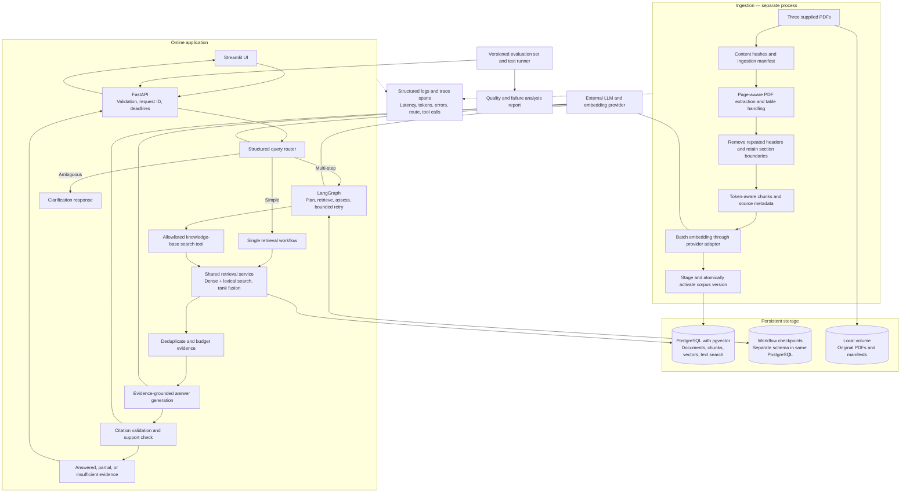
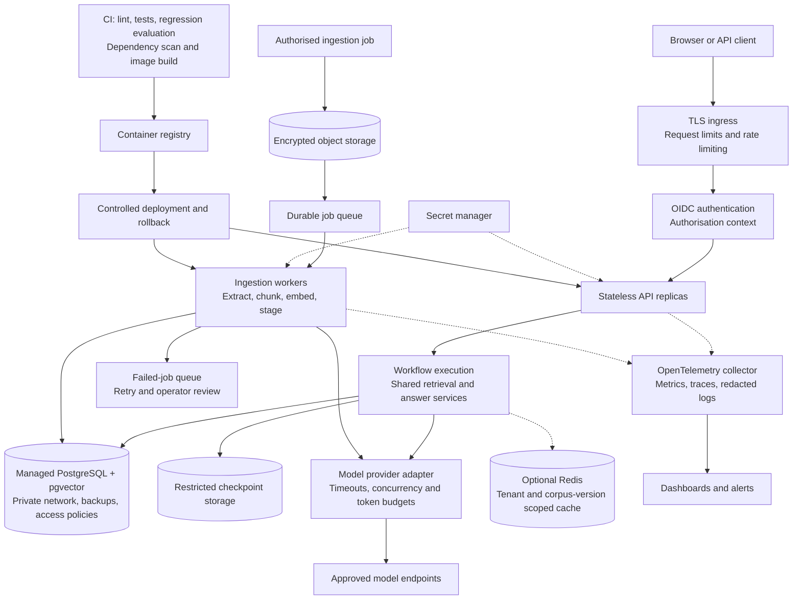
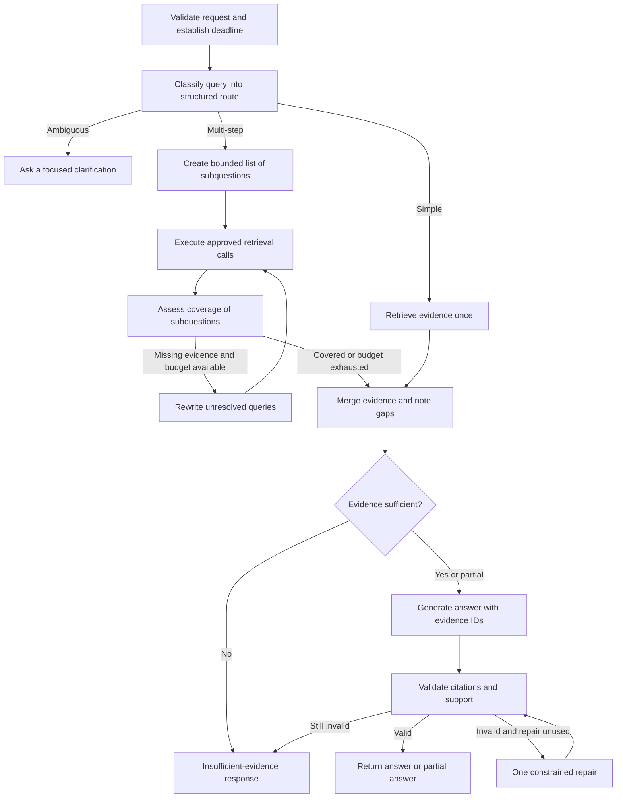

# Intelligent Knowledge Assistant — Architecture

Status: proposed design, not an implemented system. Prepared for the Senior AI Engineer / Decision Scientist assessment.

## Scope and assumptions

The existing flow is the assessment's document ingestion → persistent knowledge base → question routing → simple RAG or agentic retrieval → cited answer. The workspace contains no existing implementation to preserve.

The three supplied corpus PDFs are the primary knowledge base. The assessment itself is a specification, not a knowledge-base document. References to a six-document corpus are treated as a documentation inconsistency. The assistant answers from supplied evidence; historical claims are attributed to the documents rather than presented as current facts. No web search or arbitrary code execution is needed.

This design separates a runnable assessment implementation from production extensions. The extensions below are planned capabilities, not claims that the submission implements enterprise controls.

## 1. Assessment architecture



The verifier receives the retrieved evidence as well as the answer. Programmatic checks validate citation IDs; a bounded support check assesses substantive grounding. Neither is a guarantee against hallucination, so failures remain visible in evaluation.

## 2. Production deployment view



Ingestion and serving share storage contracts and provider adapters, but scale and fail independently. User identity and document permissions are trusted application context; the LLM cannot choose or override them.

## 3. Components and responsibilities

| Component | Assessment implementation | Production extension / responsibility |
|---|---|---|
| UI | Streamlit calls REST API; displays citations and workflow | Authenticated UI, accessibility, feedback capture |
| API | FastAPI with typed request/response models | TLS ingress, OIDC, rate limits, horizontal replicas |
| Router | Structured classification: simple, multi-step, ambiguous | Monitor routing accuracy and version routing prompts |
| Orchestrator | LangGraph with typed state and bounded transitions | Restricted durable checkpoints and resumable work where needed |
| Search tool | Read-only `search_knowledge_base(query, document_filter, top_k)` | Server-enforced tenant and document access |
| Retrieval | Dense vectors + PostgreSQL lexical search; reciprocal rank fusion | Tune indexes, add reranking only when evaluated |
| Evidence builder | Deduplicate chunks; enforce token budget; preserve citation IDs | Context diversity, permissions, version consistency |
| Answer generator | Produce structured answer and cited claims | Provider budgets, output validation, prompt versioning |
| Evidence verifier | Reject unknown citation IDs; assess claim support | Grounding regression checks, sampled human review |
| Ingestion | Separate CLI / one-shot Compose service | Object storage events, job queue, independent workers |
| Database | PostgreSQL + pgvector and persistent volume | Backups, restore drills, managed high availability |
| Configuration | Typed environment configuration and `.env.example` | Secret manager; separate service identities |
| Observability | JSON logs and per-stage timing | OpenTelemetry, dashboards, SLOs, privacy controls |
| Evaluation | 12 labelled cases and repeatable report | Regression gates, production sampling, drift analysis |

## 4. Ingestion flow and data model

1. Register the three source PDFs and compute a content hash. Skip a document only if both the content hash and pipeline configuration are unchanged.
2. Extract each PDF page separately. Inspect comparative tables; retain meaningful column relationships. Use OCR only for pages without usable text.
3. Remove repeated page decorations without deleting source content. Preserve headings, page numbers and tables.
4. Split by section and paragraph, using an initial target of 400–600 tokens with about 10–15% overlap. These are starting settings to tune with evaluation. Prefer page-local chunks; record a page range if a chunk spans pages.
5. Assign stable chunk IDs from document version, location and chunking configuration. Batch embeddings through a provider adapter.
6. Write a staged corpus version containing vectors and lexical text. Validate expected documents, chunk counts, dimensions and metadata.
7. Atomically activate the new corpus version. Every query pins one version for its entire run; failed ingestion leaves the prior version available.

Suggested logical entities:

| Entity | Essential fields |
|---|---|
| `documents` | document_id, filename, content_hash, source_uri, document_version, pipeline_version, status |
| `chunks` | chunk_id, document_id, corpus_version, page_start, page_end, section, text, token_count, embedding, lexical_index, embedding_model |
| `corpus_versions` | version_id, status, created_at, activated_at, pipeline_configuration |
| `ingestion_jobs` | job_id, document_id, status, attempts, safe_error, timestamps |
| `query_runs` | request_id, corpus_version, route, status, stage_timings, token_usage, prompt/model versions |
| `workflow_checkpoints` | run_id, serialised state, expiry; restricted access |
| `evaluation_cases` | case_id, question, expected_route, expected_sources, key_facts, expected_status |

Add tenant_id and document access policies when introducing multi-tenancy. Avoid raw question/answer storage by default; any retention of user content requires a defined purpose and expiry.

PostgreSQL full-text search is the initial lexical method; it is not BM25. If BM25 is later chosen, use an explicit implementation and evaluate it against the baseline. Exact vector search is adequate for this small corpus. Introduce HNSW when measured corpus size and latency justify it. Changing embedding models or dimensions requires a compatible new index/corpus version.

## 5. Query and agent flow



Typed workflow state contains question, route, subquestions, tool results, evidence IDs, unresolved facets, steps used, token usage, deadline, corpus version, final answer and status. Record action summaries and tool activity; do not expose private model reasoning.

Initial configurable limits: at most 4 subquestions, 8 retrieval calls, one answer repair, bounded retrieved tokens, and an overall request deadline. Tune these limits using measurements; they are design defaults, not measured performance claims. Tool arguments have schema validation and top_k caps. No user-controlled SQL, arbitrary URLs, shell tools or write tools.

Routing considers whether separate evidence gathering is needed, rather than only the presence of words such as “compare.” A short comparison already covered by one table can use simple RAG. Clarification is appropriate when materially different interpretations would change the answer.

Unsupported questions should abstain. Partially supported questions should clearly separate supported facts from unresolved parts. A provider outage is a service error, not a claim that the corpus lacks an answer.

## 6. API contract

`POST /v1/questions`

```json
{
  "question": "Compare pgvector and Weaviate for a production RAG assistant.",
  "document_ids": [],
  "workflow": "auto"
}
```

An empty document_ids list means all authorised documents. Optional forced workflow selection may be provided for evaluation; auto is the UI default. The server supplies identity and corpus version.

Illustrative response shape (values are placeholders, not an evaluated answer):

```json
{
  "request_id": "request-123",
  "status": "answered",
  "answer": "Grounded comparison with [S1] and [S2] citations.",
  "workflow_used": "agentic",
  "sources": [
    {
      "id": "S1",
      "document": "vector_database_comparison.pdf",
      "page_start": 4,
      "page_end": 4,
      "chunk_id": "chunk-123",
      "excerpt": "Retrieved supporting passage"
    }
  ],
  "workflow_summary": {"subquestions": 2, "retrieval_calls": 2},
  "corpus_version": "corpus-v1",
  "warnings": []
}
```

Answer statuses: answered, partial, needs_clarification, insufficient_evidence. Sources must exist in the actual evidence set; the application resolves filenames and pages from metadata rather than trusting model-generated locations. Citation pages use one-based PDF page positions, labelled consistently in the UI.

Other endpoints: `GET /health/live`, `GET /health/ready`, `GET /v1/documents`. Readiness checks database availability and an active corpus without making a billable provider request. API errors use safe messages and request IDs: validation 422, rate limit 429, unavailable dependencies 503, deadline exceeded 504. Authorised document delivery, if implemented, must apply the same access checks as search.

## 7. Docker execution and project structure

Compose services: `db`, `ingest`, `api`, `ui`. Database migrations complete before ingestion. The idempotent one-shot ingestion service exits successfully before API readiness; API starts only after ingestion succeeds. A fresh setup runs with `docker compose up --build`, once required provider credentials are configured. Persist the database in a named volume and mount source PDFs read-only. Query requests never initiate full-corpus ingestion.

```text
src/knowledge_assistant/
  api/              # Routes, schemas, dependency wiring
  ingestion/        # Extraction, chunking, manifests, version publication
  retrieval/        # Vector/lexical search, fusion, evidence construction
  workflows/        # Routing, simple RAG, LangGraph nodes and state
  providers/        # Chat and embedding interfaces / adapters
  storage/          # Repositories and migrations
  evaluation/       # Dataset runner, metrics and reports
  core/             # Configuration, telemetry, errors, limits
ui/
tests/unit/
tests/integration/
tests/api/
scripts/
configs/
data/corpus/
eval/questions.jsonl
docs/
Dockerfile
compose.yaml
.env.example
README.md
ARCHITECTURE.md
```

## 8. Reliability, security and operations

- Retry transient provider failures with capped exponential backoff and jitter, within the overall deadline. Fail fast on invalid configuration or authentication. Restrict concurrent outbound calls.
- Make ingestion idempotent. Publish staged versions atomically; retain the last working corpus until a new one passes validation.
- Treat user text and retrieved documents as untrusted data. Separate instructions from evidence, use allowlisted tools, cap input/output sizes and test prompt injection. Prompt wording alone is insufficient protection.
- Enforce authorisation in retrieval queries and source delivery, independent of model instructions. For filtered approximate search, measure recall and tune index behaviour; do not assume top_k candidates survive permission filters.
- Keep secrets out of prompts, logs, source control and images. Use environment configuration locally, a secret manager in production, least-privilege service accounts and encrypted transport/storage.
- Restrict network egress to approved provider endpoints and dependencies. Run non-root containers with resource limits. Keep the database private.
- Cache only when useful: keys include tenant/access scope, corpus version, model and prompt version. Apply expiry and avoid sensitive-content retention. Redis is optional for this assessment.
- Record stage latency, route, retrieval counts, empty evidence, citation validation failures, abstention, provider errors and token usage. Alert on sustained error/latency changes and ingestion failure.
- Scale stateless API replicas and ingestion workers independently. Introduce a queue for large ingestion jobs; add async query jobs only if measured runtimes exceed synchronous request limits.
- Define retention for checkpoints, user feedback and logs. Checkpoints can contain sensitive evidence and require the same protection as the corpus.

## 9. Evaluation and verification

Use 12 corpus-grounded cases: 4 simple, 4 multi-step, 2 ambiguous and 2 unanswerable. Each case records expected source pages, key facts, acceptable status and expected routing behaviour.

| Layer | Checks |
|---|---|
| Ingestion | Table extraction samples; correct page metadata; repeat ingestion creates no duplicates; failed version is not activated |
| Retrieval | Recall@k against labelled evidence; precision / ranking where relevance labels exist; evidence coverage across subquestions |
| Answers | Correctness of key facts, unsupported claims, citation validity and citation support |
| Workflow | Appropriate routing, allowed tools only, budgets respected, deterministic stopping, graceful partial results |
| Security | Prompt injection, inaccessible documents, unsafe tool arguments, error/log leakage |
| Operations | Stage latency, provider calls, token usage and measured cost using current provider rates |

Unit tests cover chunk metadata, fusion, citation resolution, routing parsing and budget handling. API tests mock provider responses for reproducibility. At least one real-provider end-to-end smoke test verifies ingestion → retrieval → generation → valid citations; make credential requirements explicit. Never present mock-provider quality scores as real model evaluation.

Add cases for provider timeout, unavailable database, empty corpus, conflicting evidence and citation repair failure. Use human review alongside any LLM-based evaluator. Set release thresholds only after establishing a measured baseline.

## 10. Design choices and trade-offs

FastAPI supplies the typed REST boundary. LangGraph provides explicit workflow state and transitions, making multi-step behaviour reviewable. PostgreSQL + pgvector consolidates metadata, lexical retrieval and vectors for this small service; it avoids a second search system before workload evidence justifies one. Use a provider adapter with configurable chat and embedding models; select exact model IDs after evaluating quality, latency, availability and budget. The same embedding model and dimension configuration must be used for indexing and query vectors.

Defer a reranker, dedicated search cluster, distributed cache and Kubernetes until measurements justify them. The production diagram shows where these operational concerns belong without making them prerequisites for the assessment.

## References

- Local specification: `/Users/A3121227/Downloads/Technical assessment/Senior_AI_Engineer_Technical_Assessment.pdf`
- Supplied corpus: `rag_architecture_patterns.pdf`, `vector_database_comparison.pdf`, `agentic_ai_frameworks.pdf` in the same folder.
- FastAPI container deployment: https://fastapi.tiangolo.com/deployment/docker/
- LangGraph state and checkpoint components: https://reference.langchain.com/python/langgraph/overview
- pgvector exact/approximate search and filtering: https://github.com/pgvector/pgvector

Official documentation was checked for these capabilities. No specific library version, provider pricing or benchmark is asserted by this design.
