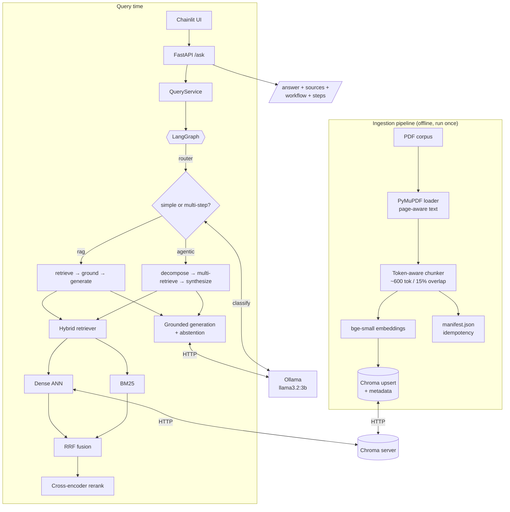

# Intelligent Knowledge Assistant

A production-oriented, **local-first** Retrieval-Augmented Generation (RAG) service with an
**agentic workflow** for multi-step questions. It answers questions over a corpus of technical
documents (RAG architecture, vector databases, agentic AI frameworks), returns **grounded answers
with citations**, routes complex questions through a **LangGraph** agent, and **declines to answer**
when the knowledge base lacks the information.

The entire stack runs locally with **no API keys** — Ollama for generation, sentence-transformers for
embeddings — and starts with a single `docker compose up`.

---

## Table of contents

- [Problem understanding](#problem-understanding)
- [Architecture](#architecture)
- [How it works](#how-it-works)
- [Technology choices & rationale](#technology-choices--rationale)
- [Repository structure](#repository-structure)
- [Quickstart (Docker)](#quickstart-docker)
- [Quickstart (local dev)](#quickstart-local-dev)
- [API usage](#api-usage)
- [Configuration](#configuration)
- [Evaluation](#evaluation)
- [Testing](#testing)
- [Design decisions & trade-offs](#design-decisions--trade-offs)
- [Security & responsible AI](#security--responsible-ai)
- [Limitations](#limitations)
- [Future improvements](#future-improvements)

---

## Problem understanding

The task is to build a question-answering system over unstructured documents that:

1. **Ingests** documents into a reusable pipeline (load → chunk → embed → store) with provenance
   metadata, kept **separate** from query time.
2. Answers with **RAG** — retrieving relevant evidence and grounding the LLM's answer in it, with
   **source citations**, and **refusing to fabricate** when evidence is missing.
3. Uses an **agentic workflow** for questions needing multiple steps / retrievals / comparison, and
   **decides** when simple RAG suffices versus when the agent is needed.
4. Exposes a **REST API** with a clear request/response contract including the answer, sources, and
   the workflow used.
5. Is **containerised**, **evaluated**, **tested**, and **documented**.

This corpus is deliberately self-referential (it describes RAG, vector DBs, and agent frameworks),
which enables cross-document comparison questions, multi-step reasoning, and clean out-of-scope
("unanswerable") testing.

---

## Architecture



A detailed component and sequence diagram is in [docs/architecture.md](docs/architecture.md).

---

## How it works

### 1. Ingestion (offline, separate from the API)
- **Loading** — [PyMuPDF](https://pymupdf.readthedocs.io/) extracts text **per page**, preserving the
  document name and page number.
- **Chunking** — a token-aware, sentence-boundary-preserving splitter packs ~600 tokens per chunk
  with ~15% overlap (tiktoken as a model-agnostic token proxy). Each chunk carries
  `document`, `title`, `page`, `chunk_id`, `chunk_index`, char offsets, `token_count`, and a
  `content_hash`.
- **Embedding + storage** — chunks are embedded with `BAAI/bge-small-en-v1.5` and upserted into a
  **Chroma** collection (cosine space).
- **Idempotency** — a `manifest.json` records each document's file hash; unchanged files are skipped,
  and `--rebuild` forces a clean re-ingest. Changing the embedding model auto-triggers a rebuild.

Run as a one-shot job (`ka-ingest run`) — it never runs on the query path.

### 2. Retrieval (hybrid + rerank)
- **Dense** vector search over Chroma + **BM25** sparse search (built in-memory from the stored
  corpus, always in sync).
- Results are fused with **Reciprocal Rank Fusion (RRF)** — robust to score-scale differences — then
  reordered by a **cross-encoder reranker** (`BAAI/bge-reranker-base`) for precision.
- Metadata filtering (e.g. restrict to a single document) is supported on both paths.

### 3. RAG answering + grounding
- The LLM is prompted to answer **only** from the retrieved context, cite sources inline as `[n]`,
  and **treat context as untrusted data** (prompt-injection mitigation).
- A **grounding gate** (retrieval-score threshold, optionally an LLM sufficiency check) plus an
  **abstention sentinel** ensure the system says *"I don't have enough information…"* instead of
  hallucinating. Citations are mapped from the `[n]` markers actually used.

### 4. Agentic workflow (LangGraph)
A compiled state machine with explicit nodes and typed state:

- **router** → classifies the query as `rag` or `agentic` using lexical heuristics
  (`compare`, `versus`, `differences between`, multiple questions…) **plus** an LLM fallback
  classifier. Forced modes (`rag`/`agentic`) bypass the router.
- Simple path: **simple_rag** (retrieve → ground → generate).
- Agentic path: **decompose** (break into sub-questions) → **multi_retrieve** (retrieve per
  sub-question, aggregate) → **synthesize** (ground + generate the final cited answer).
- Every node records a **step** for transparency, catches its own errors, and degrades gracefully
  (bounded by `agent_max_steps`).

---

## Technology choices & rationale

| Concern | Choice | Why |
|---|---|---|
| **LLM** | Ollama `llama3.2:3b` (configurable → `llama3.1:8b`, OpenAI/Azure) | Fully local, no keys, low-latency default; swap to 8B or a hosted model via one env var for higher quality. A thin provider interface swaps in OpenAI via config. |
| **Embeddings** | `BAAI/bge-small-en-v1.5` (sentence-transformers) | Strong retrieval quality at 384-dim/small size; runs on CPU; query-instruction prefix supported. |
| **Vector store** | **Chroma** (separate server) | Simple, persistent, good metadata filtering; separate service cleanly decouples ingestion from query and avoids file-lock issues. |
| **Retrieval** | Hybrid dense + BM25 → RRF → cross-encoder rerank | Dense captures semantics, BM25 captures exact terms (e.g. `pgvector`, `hnsw`); RRF + rerank maximise precision. |
| **Agent framework** | **LangGraph** | Explicit, inspectable state-machine graph — ideal for routing, multi-step control, and step/state tracking the assessment emphasises. |
| **API** | **FastAPI** | Async, typed, automatic OpenAPI docs, Pydantic validation. |
| **UI** | **Chainlit** | Minimal chat UI that surfaces answers, sources, and the workflow used. |
| **Config** | pydantic-settings (layered) | Typed config: code defaults < `configs/default.yaml` < `.env` < environment; secrets only via env. |

---

## Repository structure

```
.
├── src/knowledge_assistant/
│   ├── core/            # config (pydantic-settings), structlog logging, errors, domain models
│   ├── providers/       # LLM + embedding provider protocols; Ollama / sentence-transformers / OpenAI; factory
│   ├── ingestion/       # PyMuPDF loader, token-aware chunker, pipeline, manifest, CLI (ka-ingest)
│   ├── vectorstore/     # Chroma HTTP wrapper (upsert/query/get/list)
│   ├── retrieval/       # dense, bm25, RRF fusion, cross-encoder rerank, HybridRetriever, filters
│   ├── rag/             # prompts, grounded generator, grounding gate, citations
│   ├── agent/           # LangGraph state, router, nodes, tools, graph
│   ├── service/         # QueryService facade (routing → rag/agent → result)
│   ├── eval/            # metrics, runner, RAGAS adapter, CLI (ka-eval)
│   └── api/             # FastAPI app, routes, schemas
├── ui/chainlit_app.py   # demo UI
├── scripts/             # ingest.py, evaluate.py, download_models.py
├── configs/             # default.yaml (tunables), eval_set.yaml (14 questions)
├── tests/               # unit/ + e2e/ (48 tests, hermetic)
├── docker/              # Dockerfile, ollama-entrypoint.sh
├── docs/architecture.md # detailed diagrams + data flow
├── docker-compose.yml   # ollama + chroma + ingest + api + ui
├── .env.example         # all configuration (no secrets)
└── pyproject.toml
```

---

## Quickstart (Docker)

Prerequisites: Docker (with Compose). First run pulls `llama3.2:3b` (~2 GB) and bakes the local
embedding/reranker models into the image, so the initial build/boot takes a while; subsequent runs
are fast.

```bash
cp .env.example .env            # optional; sensible defaults work out of the box

# Auto-detects hardware (NVIDIA GPU -> accelerated Ollama; otherwise CPU):
make up                         # or: ./scripts/run.sh

# Always-portable fallback (CPU-only, any OS/arch):
docker compose up --build
```

Boot order is orchestrated via health checks: **ollama** (pulls the model) → **chroma** →
**ingest** (one-shot, populates the KB) → **api** → **ui**.

- API:   http://localhost:8080  (OpenAPI docs at `/docs`)
- UI:    http://localhost:8501
- Chroma: http://localhost:8000, Ollama: http://localhost:11434

Re-running is safe — ingestion is idempotent and won't re-process unchanged docs.

### Portability & hardware acceleration

The stack is **portable by default and auto-optimised when possible**:

- **CPU everywhere** — the base `docker compose up` uses multi-arch images (amd64 + arm64) and runs
  unchanged on Linux, Windows (WSL2), and Apple Silicon.
- **NVIDIA GPU** — `make up` / `./scripts/run.sh` detects an NVIDIA GPU + container runtime and layers
  in `docker-compose.gpu.yml`, so Ollama uses the GPU automatically.
- **App ML device** — embeddings/reranker resolve `KA_EMBEDDING_DEVICE=auto` → `cuda` > `mps` > `cpu`
  at runtime, so they use CUDA in a GPU container or Metal (MPS) when run natively on macOS.
- **Apple Metal** — containers can't access Metal; for Mac speedups run Ollama natively and set
  `KA_OLLAMA_BASE_URL=http://host.docker.internal:11434` (the launcher prints this hint).

### Behind a corporate proxy

Model pulls happen **inside** the Ollama container. If your network requires a proxy, `make up`
auto-detects and wires it:

- **Forward proxy:** export `HTTPS_PROXY` (and `HTTP_PROXY`); they pass through to Ollama pulls —
  e.g. `HTTPS_PROXY=http://proxy:port make up`.
- **TLS-intercepting proxy:** drop your corporate root CA at `certs/corp-ca.crt` (git-ignored);
  `make up` mounts it and the entrypoint appends it to the container trust store.

The app/ingest services load models offline (baked into the image), so they need no proxy or CA for
HuggingFace.

### Restricted / air-gapped networks

The stack is designed to **always come up**, even when model downloads are blocked:

- **Resilient boot:** the Ollama container is healthy as soon as its server responds; the model pull
  runs in the background (best-effort, retried). If it fails, the API still starts and **degrades
  gracefully** (answers abstain, `/ready` reports the LLM as unavailable) instead of hanging.
- **Model fallback:** if the configured model isn't pulled, the LLM provider automatically uses any
  other model already present (e.g. a cached `llama3.1:8b`). Override explicitly with
  `KA_OLLAMA_MODEL=llama3.1:8b` if preferred.
- **Build needs network once:** `docker compose up --build` downloads the embedding/reranker models
  (baked for offline runtime) and the Ollama model. Behind a TLS-intercepting proxy, build this once
  on an unrestricted network (the image is then fully offline/portable), or configure Docker's build
  proxy/CA.

> Public images (`ollama/ollama`, `chromadb/chroma`) are used for portability; swap in an internal
> mirror/registry if required.

---

## Quickstart (local dev)

Prerequisites: Python 3.11/3.12, [uv](https://docs.astral.sh/uv/), a running Chroma and Ollama.

```bash
# 1. Install
uv venv && uv pip install -e ".[dev,ui]"

# 2. Start backing services (example)
docker run -d -p 8000:8000 chromadb/chroma:latest
ollama serve & ollama pull llama3.2:3b

# 3. Ingest the corpus (KA_CHROMA_HOST=localhost KA_OLLAMA_BASE_URL=http://localhost:11434)
uv run ka-ingest run

# 4. Run the API and the UI
uv run uvicorn knowledge_assistant.api.app:app --port 8080
uv run chainlit run ui/chainlit_app.py --port 8501
```

A `Makefile` wraps these (`make install`, `make ingest`, `make api`, `make ui`, `make test`,
`make evaluate`, `make up`).

---

## API usage

### `POST /ask`

Request:

```json
{
  "question": "Compare FAISS and pgvector for production RAG.",
  "mode": "auto",
  "top_k": 5,
  "document": null
}
```

Response:

```json
{
  "answer": "FAISS is a GPU-capable ANN library... pgvector adds vector search to PostgreSQL... [1][2]",
  "abstained": false,
  "grounded": true,
  "workflow": "agentic",
  "sources": [
    {"document": "vector_database_comparison.pdf", "page": 3, "chunk_id": "…:p3:c0", "score": 0.72, "snippet": "FAISS — Facebook AI Similarity Search…"}
  ],
  "steps": [
    {"name": "router", "detail": "route=agentic (heuristic)"},
    {"name": "decompose", "detail": "2 sub-questions"},
    {"name": "multi_retrieve", "detail": "2 queries -> 8 chunks"},
    {"name": "synthesize", "detail": "grounded=true chunks=8"}
  ],
  "sub_questions": ["What is FAISS?", "What is pgvector?"],
  "latency_ms": 4213.0,
  "request_id": "a1b2c3…"
}
```

Examples:

```bash
# Simple RAG
curl -s localhost:8080/ask -H 'content-type: application/json' \
  -d '{"question":"What chunking strategies does the RAG reference describe?"}'

# Multi-step (agentic)
curl -s localhost:8080/ask -H 'content-type: application/json' \
  -d '{"question":"Compare FAISS, pgvector, and Chroma for production RAG."}'

# Unanswerable (graceful abstention)
curl -s localhost:8080/ask -H 'content-type: application/json' \
  -d '{"question":"What is the capital of France?"}'
```

Other endpoints: `GET /health` (liveness), `GET /ready` (dependency checks), `GET /documents`
(indexed documents), `GET /docs` (OpenAPI).

---

## Configuration

All settings are environment variables prefixed with `KA_` (see [.env.example](.env.example)).
Highlights:

| Variable | Default | Description |
|---|---|---|
| `KA_LLM_PROVIDER` | `ollama` | `ollama` or `openai` |
| `KA_OLLAMA_MODEL` | `llama3.2:3b` | Generation model |
| `KA_EMBEDDING_MODEL` | `BAAI/bge-small-en-v1.5` | Embedding model |
| `KA_RERANKER_ENABLED` / `KA_RERANKER_MODEL` | `true` / `bge-reranker-base` | Cross-encoder rerank |
| `KA_CHROMA_HOST` / `KA_CHROMA_PORT` | `chroma` / `8000` | Vector store |
| `KA_CHUNK_SIZE_TOKENS` / `KA_CHUNK_OVERLAP_TOKENS` | `600` / `90` | Chunking |
| `KA_RETRIEVAL_TOP_K` / `KA_DENSE_TOP_K` / `KA_BM25_TOP_K` | `5` / `20` / `20` | Retrieval |
| `KA_GROUNDING_MIN_SCORE` | `0.15` | Abstention threshold |
| `KA_ROUTER_MODE` | `auto` | `auto` / `rag` / `agentic` |

Secrets (e.g. `KA_OPENAI_API_KEY`) are **only** read from the environment, never from YAML, and
`.env` is git-ignored.

---

## Evaluation

The evaluation set ([configs/eval_set.yaml](configs/eval_set.yaml)) has **14 questions** across four
categories: **simple** (5), **multi-step** (4), **ambiguous** (2), and **unanswerable** (3), each
annotated with expected documents, expected workflow, abstention expectation, and key facts.

Run it:

```bash
uv run ka-eval run                 # writes eval_results/eval_report.{json,md}
uv run ka-eval run --no-judge      # skip the LLM-as-judge (deterministic metrics only)
uv run ka-eval run --ragas         # also compute optional RAGAS metrics
```

**Metrics**

- **Retrieval quality** — `hit@k`, `recall@k`, `MRR` against the expected source documents
  (deterministic).
- **Answer quality / grounding** — an **LLM-as-judge** (local Ollama) scores **faithfulness**
  (is the answer supported by the retrieved context?) and **relevance**; plus a lexical
  **key-fact coverage** check.
- **Agent / workflow behaviour** — **routing accuracy** (did `auto` pick the expected workflow?) and
  **abstention accuracy** (did it correctly answer vs. decline?).
- Optional **RAGAS** (faithfulness / answer-relevancy / context-precision) wired to the same local
  models.

The report aggregates overall and **per category**, making failure modes (e.g. an unanswerable
question that didn't abstain, or a comparison routed as simple) easy to spot.

### Results

Results are generated by the harness and written to `eval_results/eval_report.md`.
Run `uv run ka-eval run` (requires Ollama with the model pulled), then paste the summary here:

| Metric | Overall |
|---|---|
| Routing accuracy | _TBD_ |
| Abstention accuracy | _TBD_ |
| hit@k / recall@k / MRR | _TBD_ |
| Faithfulness (LLM-judge) | _TBD_ |
| Answer relevance (LLM-judge) | _TBD_ |
| Mean latency (ms) | _TBD_ |

**Validated against the live stack:** *"What index types does pgvector support?"* returns the
`pgvector` section of `vector_database_comparison.pdf` as the top hit (found by **both** dense and
BM25); *"What does FAISS provide and its limitations?"* returns a grounded answer citing
`vector_database_comparison.pdf p.3`; out-of-corpus questions abstain with *"I don't have enough
information…"*.

---

## Testing

62 hermetic tests (no network, no live services) — `uv run pytest`:

- **Unit** — chunking, PDF header de-spacing, RRF fusion, metadata filters, citation
  parsing/assembly, grounding gate, router logic, query-rewrite fallback, device auto-detection,
  provider factories + Ollama model-fallback, evaluation metrics.
- **Integration (in-process)** — the Chroma store and the full hybrid retriever run against an
  **embedded Chroma client** with deterministic fake embeddings; the **agent graph** runs
  end-to-end with a scripted fake LLM (simple, agentic, abstention, and rewrite-recovery paths).
- **End-to-end API** — FastAPI `TestClient` exercises `/ask` (RAG, agentic, abstain), `/health`,
  `/ready`, `/documents`, validation, and the `X-Request-ID` header, with the service stubbed.

Quality gates: `ruff` (lint) and `mypy` (strict typing) both pass.

---

## Design decisions & trade-offs

**Scalability.** Ingestion is decoupled from serving and is idempotent, so the corpus can grow
without touching the query path. Chroma runs as its own service and can be scaled or swapped for a
managed store (Qdrant/pgvector/Pinecone) behind the same `ChromaVectorStore` seam. The stateless API
scales horizontally; the only in-process state is the BM25 index (rebuilt from Chroma and trivially
cacheable). For large corpora, BM25 would move to a dedicated service (e.g. OpenSearch) or a
persisted index.

**Latency.** Hybrid retrieval + cross-encoder rerank + local 8B generation is the dominant cost.
Mitigations in place: reranking is capped to a candidate pool, `top_k` is tunable, and the reranker
can be disabled via config. Further levers: smaller/quantised models, GPU inference, caching of
embeddings and frequent queries, and streaming responses.

**Cost.** Default deployment is **$0 external** — everything runs locally. The provider abstraction
lets you trade cost for quality/latency by switching to a hosted LLM without code changes.

**Reliability / failure handling.** Providers use timeouts + retries (tenacity); every agent node
catches its own failures and degrades to a safe abstention; the API maps domain errors to safe HTTP
statuses (`503` for provider/store outages) and never leaks internals; `/ready` reports dependency
health; startup never blocks if a dependency is temporarily down.

**Security.** No secrets in the repo; input validation at the boundary (length/body limits);
prompt-injection-aware prompting (context treated as untrusted data); generic client-facing error
messages; local-first data residency.

**Monitoring & evaluation in production.** Structured JSON logs with a per-request `request_id`,
workflow, grounding flag, citation count, and latency are emitted for every request — ready for
shipping to a log/metrics backend. The offline eval harness can run in CI against a golden set to
catch regressions; online, I'd track abstention rate, retrieval score distributions, latency
percentiles, and sample answers for human review, and add tracing (e.g. OpenTelemetry/LangSmith) over
the agent graph.

---

## Security & responsible AI

- **No committed secrets** — `.env` is git-ignored; only `.env.example` (no values) is tracked.
- **Input validation** — Pydantic enforces question length and payload shape; `top_k` is bounded.
- **Prompt-injection awareness** — the system prompt instructs the model to treat retrieved context
  as untrusted data and ignore instructions embedded in documents.
- **Grounding & honesty** — score-gated abstention + a fixed refusal sentinel prevent fabrication;
  answers cite their sources.
- **Safe errors** — internal exceptions are logged server-side; clients receive generic messages.
- **Data privacy** — default stack makes **no external calls**; documents and embeddings stay local.

---

## Limitations

- **PDF extraction artifacts** — some section headers in the sample PDFs use letter-spacing (e.g.
  `S E C T I O N`); the loader normalises these, but exotic PDF layouts/tables may still extract
  imperfectly.
- **Local small model** — the default `llama3.2:3b` favours latency; answer/routing quality is below
  larger or hosted models. Swap via `KA_OLLAMA_MODEL` (e.g. `llama3.1:8b`) or the OpenAI provider.
- **BM25 in-memory** — rebuilt at startup from Chroma; fine for this corpus, not for very large ones.
- **Single-turn** — no conversational memory / follow-up context (by design for this scope).
- **Build needs network once** — the image bakes the embedding/reranker models for offline runtime,
  so the initial `--build` requires HuggingFace access (and the first boot pulls the Ollama model).
  Behind a TLS-intercepting proxy, build once on an unrestricted network — the image is then fully
  offline/portable. The runtime itself makes no HuggingFace calls.

---

## Future improvements

- Token **streaming** (SSE) through the API and UI for responsiveness.
- **Semantic / layout-aware chunking** and header normalisation; table extraction.
- **Reranker/embeddings on GPU**, quantised LLM, and a **query/embedding cache**.
- **Answer-level faithfulness verification** (claim-by-claim) and self-correction loops in the agent.
- **Conversational memory** and query rewriting for follow-ups.
- **CI** (lint + typecheck + hermetic tests) and **tracing** (OpenTelemetry/LangSmith).
- Swap Chroma for **pgvector/Qdrant** in higher-scale deployments (already behind an interface).

---

## License

MIT — see `pyproject.toml`. Built for a technical assessment; the sample corpus is provided with the
assessment.
