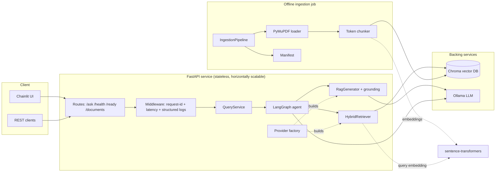
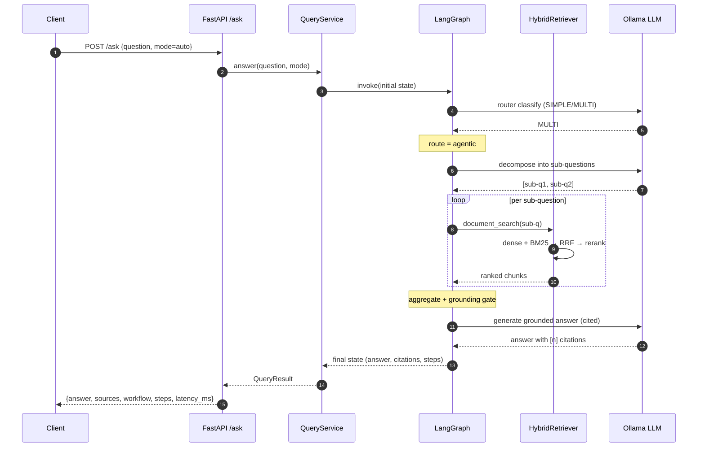
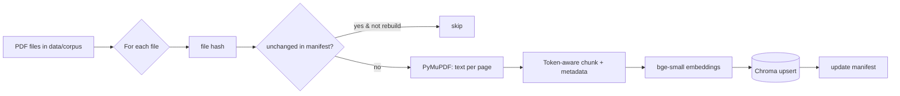
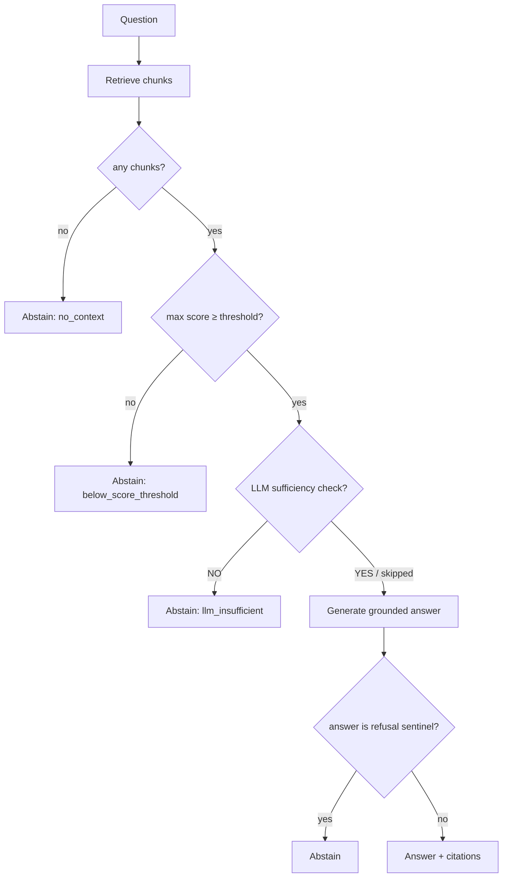

# Architecture

This document complements the top-level [README](../README.md) with detailed component, sequence,
and data-flow diagrams, plus module responsibilities.

## 1. Component overview

> Embeddings run **in-process** via sentence-transformers (not a separate service); the diagram
> separates them for clarity. The LLM (Ollama) is the only external model service.

## 2. Request sequence — agentic path

For a **simple** question the router returns `rag`, and the graph runs a single
`retrieve → ground → generate` node before returning — no decomposition.

## 3. Ingestion data flow

Ingestion is **idempotent** (content-hash keyed) and **decoupled** from the query path. It runs as a
one-shot CLI (`ka-ingest run`) or a one-shot compose service.

## 4. Grounding & abstention decision

## 5. Module responsibilities

| Module | Responsibility |
|---|---|
| `core/config.py` | Layered, typed settings (defaults < YAML < `.env` < env). Secrets only from env. |
| `core/logging.py` | Structured (structlog) logging; JSON in prod, console locally; request-id binding. |
| `core/models.py` | Internal domain models: `Chunk`, `ChunkMetadata`, `RetrievedChunk`, `Citation`. |
| `providers/` | `LLMProvider` / `EmbeddingProvider` protocols; Ollama, sentence-transformers, OpenAI impls; config-driven factory. |
| `ingestion/` | Loader, token-aware chunker, pipeline, idempotency manifest, CLI. |
| `vectorstore/` | Chroma HTTP wrapper: upsert/query/get_all/list/reset/health. |
| `retrieval/` | Dense, BM25, RRF fusion, cross-encoder rerank, `HybridRetriever`, metadata filters. |
| `rag/` | Prompts (injection-aware), grounded generator, grounding gate, citation assembly. |
| `agent/` | LangGraph state, router (heuristics + LLM), nodes, tools, graph builder. |
| `service/` | `QueryService` facade; builds and invokes the graph; maps to `QueryResult`. |
| `eval/` | Deterministic + LLM-judge metrics, runner, optional RAGAS, CLI. |
| `api/` | FastAPI app factory, routes, request/response schemas, error handling. |

## 6. Key design decisions (summary)

- **Local-first with a provider seam** — zero-key reproducibility now; trivial upgrade to hosted
  models later.
- **Hybrid retrieval + rerank** — semantics (dense) + exact terms (BM25) + precision (cross-encoder),
  fused with rank-based RRF to avoid score-scale coupling.
- **Unified graph for both paths** — routing, simple RAG, and the agentic flow live in one LangGraph
  state machine, giving consistent step/state tracking and a single place to reason about control
  flow.
- **Grounding as a first-class gate** — score threshold + injection-aware prompt + refusal sentinel,
  so "I don't know" is a designed outcome, not an accident.
- **Separation of concerns** — ingestion, retrieval, generation, agent, and transport are independent
  and independently testable (48 hermetic tests).
